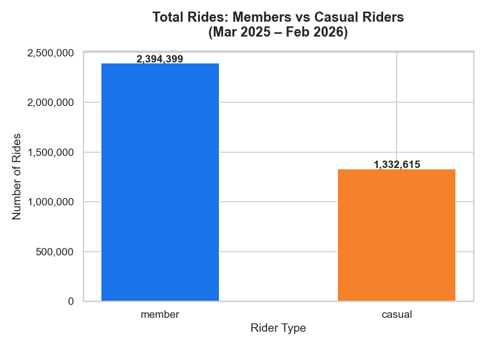
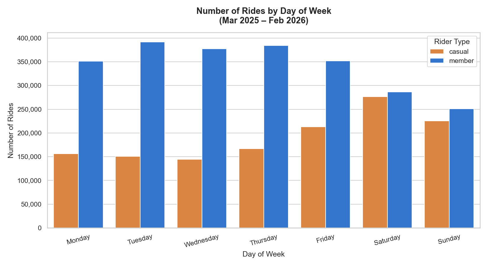
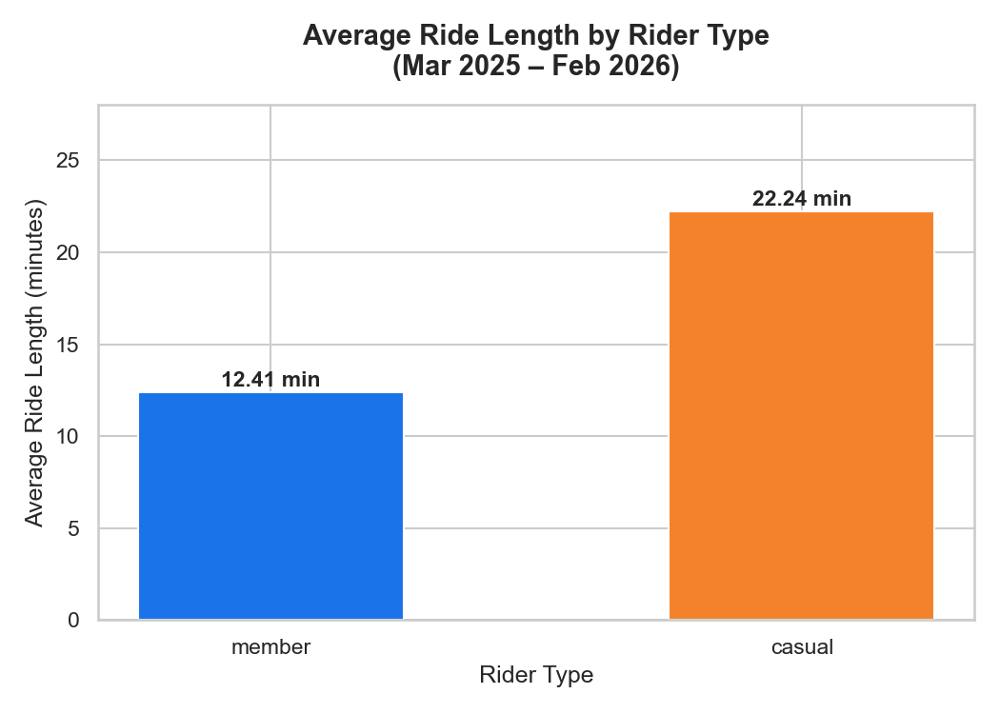
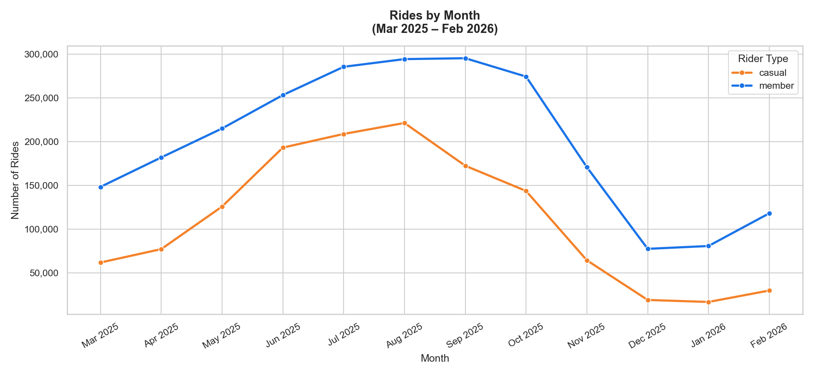
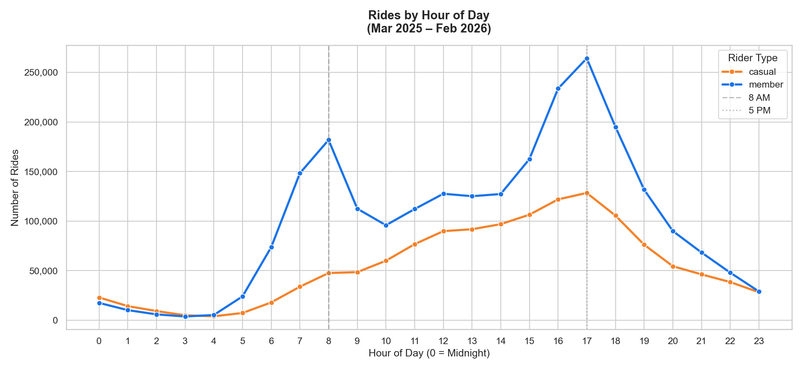
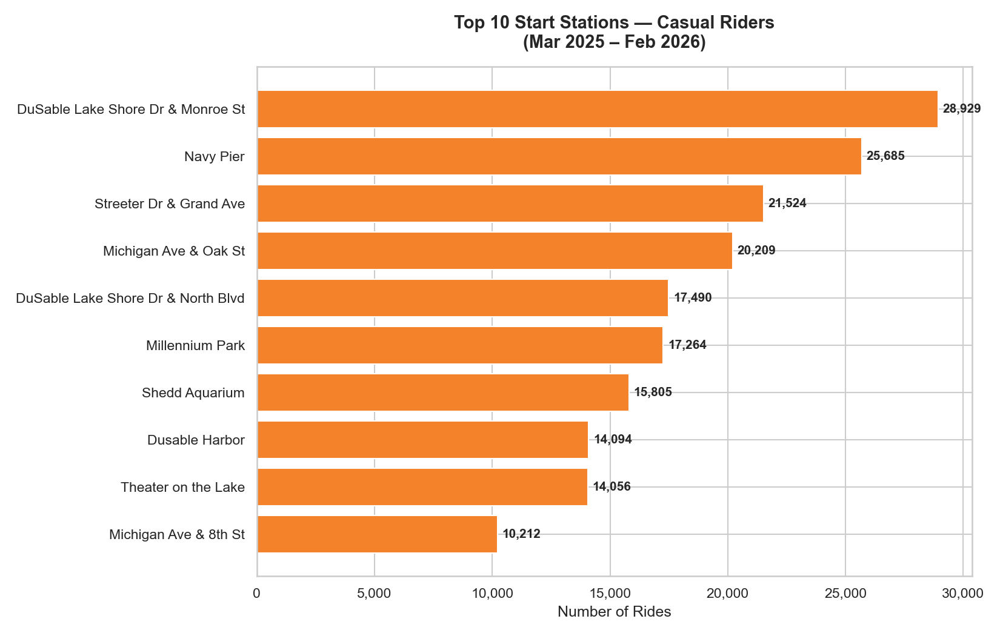

# 🚲 Cyclistic Bike-Share Analysis
### Google Data Analytics Capstone Project

**Analyst:** Hammad Muhammad  
**Date:** March 2026  
**Tools:** Python, SQL (SQLite), Excel  
**Data:** Divvy Trip Data — March 2025 to February 2026 (3,727,014 rides)
https://www.kaggle.com/code/iaamhammad/cyclistic-analysis
---

## Business Task

Cyclistic is a Chicago-based bike-share company with over 5,800 bikes and 600 docking stations. The marketing director believes the company's future growth depends on converting casual riders into annual members.

**The question assigned:** How do annual members and casual riders use Cyclistic bikes differently?

---

## Key Findings

| Finding | Members | Casual Riders |
|---|---|---|
| Total Rides | 2,394,399 (64.2%) | 1,332,615 (35.8%) |
| Avg Ride Length | 12.41 minutes | 22.24 minutes |
| Peak Day | Tuesday | Saturday |
| Peak Season | Summer (35%) | Summer (47%) |
| Winter Rides | 275,864 (12%) | 65,035 (5%) |
| Peak Hours | 8 AM and 5 PM | 5 PM only |
| Usage Pattern | Commuting / routine | Leisure / recreational |

**Members** ride on weekdays during rush hours — a clear commuting pattern.  
**Casual riders** ride on weekends during afternoons — a clear leisure pattern.

---

## Visualizations







---

## Top 3 Recommendations

**1. Launch Weekend and Summer Membership Campaigns**  
Casual riders peak on Saturdays (276,217 rides) and 47% of their rides happen in summer. A targeted campaign during June–August would reach them at their most engaged moment.

**2. Place Ads at Top Casual Rider Stations**  
All top 10 casual start stations are tourist and leisure landmarks — Navy Pier, Millennium Park, Shedd Aquarium. Physical ads or QR codes at these docks with a cost comparison would target riders at point of use.

**3. Show Personalised Cost Savings in the App**  
Casuals ride 79% longer per trip (22.24 min vs 12.41 min), meaning they pay significantly more per outing than members. An in-app feature showing how much they would have saved with a membership creates a direct financial incentive to convert.

---

## Project Structure

```
├── cyclistic_analysis.ipynb        ← Full analysis notebook
├── Case_Study_1_...pdf             ← Original business brief
├── chart1_total_rides.png
├── chart2_rides_by_day.png
├── chart3_avg_ride_length.png
├── chart4_rides_by_month.png
├── chart5_rides_by_hour.png
├── chart6_top_stations.png
└── Case_Study_1_How_does_a_bike-share_navigate_speedy_success.pdf
```

---

## Data Source

Public trip data provided by Motivate International Inc. under the [Divvy Data License Agreement](https://www.divvybikes.com/data-license-agreement).  
Raw CSV files are not included in this repository due to file size (12 monthly files, ~5.6M rows).

---

## How to Run

1. Download the 12 monthly CSV files from [divvy-tripdata.s3.amazonaws.com](https://divvy-tripdata.s3.amazonaws.com/index.html)
2. Place them in a `data/raw/` folder
3. Update the file path in Cell 7 of the notebook
4. Run all cells top to bottom
